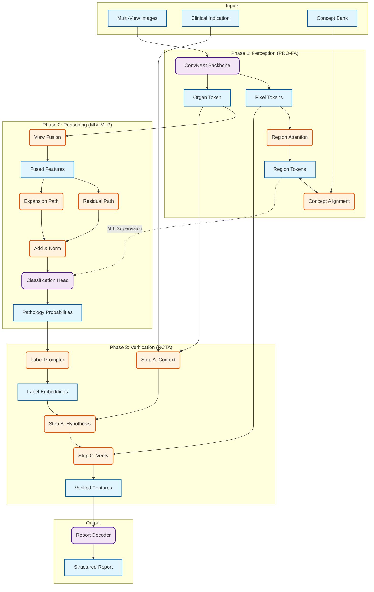

# CogRRG: Cognitive Radiology Report Generation

A cognitive framework for chest X-ray analysis with multi-label pathology classification.



## Overview

CogRRG implements a three-stage cognitive pipeline for CXR analysis:

1. **PRO-FA** - Progressive Region-Organ Feature Alignment for hierarchical visual perception
2. **MIX-MLP** - Dual-path classifier for multi-label pathology detection
3. **RCTA** - Recursive Closed-loop Triangular Attention for hypothesis verification

## Results

| Metric | Validation | Holdout |
|--------|------------|---------|
| Micro-F1 | 0.778 | 0.774 |
| Macro-F1 | 0.730 | 0.714 |
| Mean AP | 0.735 | 0.760 |

## Installation

```bash
git clone https://github.com/your-repo/BrainDead-Solution.git
cd BrainDead-Solution
pip install -r requirements.txt
```

## Project Structure

```
BrainDead-Solution/
├── data/
│   ├── dataset.py          # MIMIC-CXR data loading
│   ├── chexbert_labeler.py  # CheXpert label extraction
│   └── concepts.py          # Concept bank construction
├── models/
│   ├── encoder.py           # PRO-FA implementation
│   ├── classifier.py        # MIX-MLP with view attention
│   └── decoder.py           # RCTA verification module
├── training/
│   ├── losses.py            # Masked BCE and PRO-FA losses
│   └── trainer.py           # Training loop with AMP
├── evaluation/
│   └── chexpert_metrics.py  # Evaluation metrics
├── notebooks/
│   └── inference_demo.ipynb # Inference example
├── requirements.txt
└── README.md
```

## Quick Start

### Training

```python
from models import build_classifier
from data import create_dataloaders, subject_split, chexbert_to_binary
from training import Trainer

# Load data
train_df, val_df = subject_split(df, val_fraction=0.08)
targets, mask = chexbert_to_binary(train_df)
train_loader, val_loader = create_dataloaders(train_df, val_df, ...)

# Build model
model = build_classifier(backbone='convnext_tiny')

# Train
trainer = Trainer(model, train_loader, val_loader, optimizer)
for epoch in range(3):
    trainer.train_epoch(epoch)
    metrics = trainer.validate()
    print(f"Epoch {epoch}: macro-F1 = {metrics['macro_f1']:.4f}")
```

### Inference

```python
from models import build_classifier
import torch

model = build_classifier(pretrained=False)
model.load_state_dict(torch.load('checkpoints/best.pt')['model'])
model.eval()

# prediction
with torch.no_grad():
    logits = model(views, view_mask)
    probs = torch.sigmoid(logits)
```

## Training Details

- **Backbone**: ConvNeXt-Tiny (pretrained on ImageNet-1K)
- **Input**: 224×224 RGB, frontal + lateral views
- **Training**: Mixed precision, gradient accumulation
- **Hardware**: Single T4 GPU (16GB)
- **Labels**: 14 CheXpert pathologies via CheXbert weak supervision

### Training Phases

1. **Phase 1**: Smoke test on 12K samples (label validation)
2. **Phase 2**: Full training with progressive backbone unfreezing
3. **Phase 3**: PRO-FA concept alignment training

## Citation

```bibtex
@article{cogrrrg2024,
  title={CogRRG: A Cognitive Framework for Structured Chest X-Ray Report Generation},
  author={Anonymous},
  year={2024}
}
```

## License

MIT
